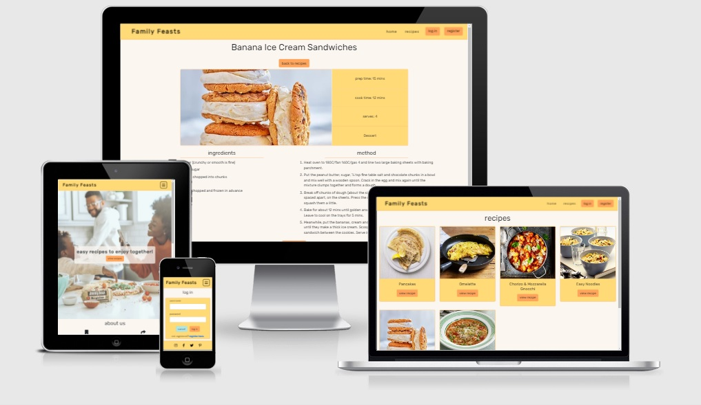
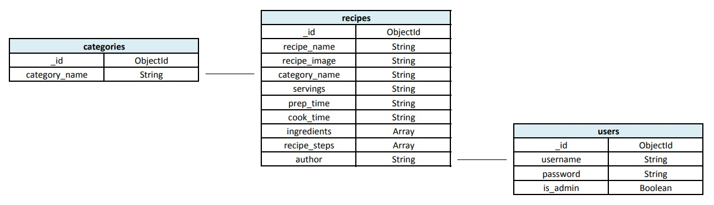

# Family Feasts

### Milestone Project Three
Family Feasts is a cooking e-book that aims to build a library of recipes that will inspire households and families to get off the couch and into the kitchen to cook together! Any member of the family will be able to browse, search and follow recipes that have been posted up by the online community. Users will be encouraged to join the community by signing up to share their family favourites in order to encourage others to cook and spend time with their loved ones.

## Demo
The live site can be viewed here - [Family Feasts](https://family-feast.onrender.com/).

GitHub repository can be viewed here - [mitchdavenport88/family-feasts](https://github.com/mitchdavenport88/family-feasts).

## UX
### Strategy
The aim is to create a simple, user friendly recipe e-book using the functionality of creating, reading, updating and deleting data objects. The sites premise is built around the idea of getting households (primarily families) cooking together, spending time together and making tea time that little bit more exciting! Although the site will have a family orientated feel and be suited for users of all ages there is no reason why it shouldn’t also be suitable for other types of users such as couples and housemates as the message is still relevant.

Any user should be able to access and view recipes that have been uploaded to the platform. Results and information should be shown in an appropriate and clear way, with the user having the ability to filter and search for recipes by using keywords or ingredients. In order to create, edit and delete recipes users will have to register. Once registered users will also have access to their own personal profile page/dashboard where their uploaded recipes will be displayed. The site’s admin will have all these privileges as well as the ability to edit and delete other user’s entries along with being able to add further content at a later date.

### User Stories
As a first time user I'd like:
* To access and view all recipes.
* To be able to browse by recipe category.
* Information on each recipe to be presented in a clear and concise manner.
* To search for suitable recipes by using keywords or ingredients.
* To sign up to the community easily.
* The site to be easy to navigate around and user friendly.
* To do all of the above regardless of what device I’m using.

As a returning user I'd like:
* To login and logout easily.
* To be able to create and post new recipes to the site.
* Access to my own personal profile where I can view my posted recipes.
* The ability to edit and delete my recipes.
* Feedback when I’m interacting with the site and whilst inputting data.

As the site owner / admin I want:
* The ability to edit and delete any recipes regardless of who posted it.
* The ability to remove user profiles if needed.
* To be able to add new categories, edit and delete existing ones.

### Scope - functionality
* The site must have a section where all recipes are displayed, for all visitors to see.
* Present the relevant information on each individual recipe on its own page following a pre-determined template.
* Allow users to login or register in order to be able to contribute towards the sites content (add, edit and delete recipes).
* The user will be able to add, edit and delete recipes once logged in/registered.
    * Methods of data input must be clear and easy to operate.
    * Restrictions will need to be placed on what registered users can see and use verses what unregistered users can see and use.
* The site will need to feed relevant information back to the user when required and appropriate. 
* We want the user to remain engaged throughout use so must be user-friendly and easy to navigate around.
* Function as expected:
    * Fully responsive on all devices.
    * Links or buttons take you to the expected place or complete the expected task.
    * External links must open in new windows.

### Scope - content
* A home page that tells the user all about Family Feasts and talks about the site’s message in more detail.
* A recipes page, where all recipes will be displayed.
    * All recipes shown on this page will have to be done so in a visually appealing manner.
    * Users will want the ability to interact with the page by filtering and searching for results.
    * Each recipe card should act as a link to the recipe’s own page and to it's functions.
* Individual recipe pages will follow a template, which will be populated with information pulled from the database.
    * This information should be displayed in a visually appealing way.
    * Information should be clear to understand and follow.
* Log in / registration forms will grant/deny access to the sites features (adding, editing and deleting data objects).
    * Logout function.
* A personalised profile page that shows recipes uploaded by the user (restricted).
* Add recipe form / page should add new data objects to the database and then display them on the recipes page (restricted).
* Edit recipe form / page will edit data that already exists in the database and update the information displayed on the site (restricted).
* Recipe deletion should remove the data object from the database, with information no longer able to be viewed by users (restricted).

### Structure
Based on the information gathered during the scope the basic structure of the page will be as follows:
* Fixed navigation bar at the top of every page, with the Family Feasts logo and links to other pages. Links will alter for registered/unregistered users.
* Home page with a hero image and some information about us.
* Recipes page where all recipes will be displayed.
    * Ability to search and filter results.
    * Registered users will be able to delete and edit their own recipes from here too.
    * Each card will link to the individual recipe page.
* View recipe page will show basic information, an image, a list of ingredients and cooking instructions.
    * Registered users will also be able to edit and delete their own recipes from here.
* Login page will be a form that compares the data supplied against data that exists in the database to allow/deny entry.
    * On success the user will be sent to their user profile page.
* Registration page will be a form that inputs the supplied data into the database for future logins.
    * On success the user will be sent to their user profile page.
* User profile page will be tailored for the specific user and will show all their uploaded recipes. Once logged in the user will be able to add, edit and delete entries.
    * Users will be able to delete their account, which will remove their data from the database.
    * Logout function will be available at this point too.
* Add recipe page / form will only be accessible by registered users. This form will input the supplied data into the database, and the recipe will then be viewable on the site.
    * On successful entry the user will be sent to the newly inputted recipe page.
* Edit recipe page / form will only be accessible by the recipes author or admin. The form will be pre-populated with the recipes existing data and any changes made will overwrite the existing data in the database.
    * The recipe will then update instantly on the site.
* Footer with social media links will be at the bottom of every page. 

### Skeleton
Initial idea - [sketch](readme-docs/wireframes/initial-wireframe-sketch.jpg)

Home - [desktop](readme-docs/wireframes/home-desktop.png) | 
[tablet](readme-docs/wireframes/home-tablet.png) | 
[mobile](readme-docs/wireframes/home-phone.png).

Register and login forms - [desktop](readme-docs/wireframes/userforms-desktop.png) | 
[tablet](readme-docs/wireframes/userforms-tablet.png) | 
[mobile](readme-docs/wireframes/userforms-phone.png).

View recipes - [desktop](readme-docs/wireframes/recipe-menu-desktop.png) | 
[tablet](readme-docs/wireframes/recipe-menu-tablet.png) | 
[mobile](readme-docs/wireframes/recipe-menu-phone.png).

Individual recipe page - [desktop](readme-docs/wireframes/view-recipe-desktop.png) | 
[tablet](readme-docs/wireframes/view-recipe-tablet.png) | 
[mobile](readme-docs/wireframes/view-recipe-phone.png).

Add and update recipes - [desktop](readme-docs/wireframes/recipe-forms-desktop.png) | 
[tablet](readme-docs/wireframes/recipe-forms-tablet.png) | 
[mobile](readme-docs/wireframes/recipe-forms-phone.png).

User profile - [desktop](readme-docs/wireframes/userprofile-desktop.png) | 
[tablet](readme-docs/wireframes/userprofile-tablet.png) | 
[mobile](readme-docs/wireframes/userprofile-phone.png).

### Surface
Family Feasts is a multi-page website that is built using Bootstraps grid system. I’ve used a combination of containers, rows and columns along with the built in flexbox capabilities to position content on the pages as well as making each page responsive at all breakpoints. 

As is the trend the navigation bar is fixed at the top of the page, making for easier navigation around the site. It also houses both the websites logo and page links. The footer is of similar aesthetic to the navigation menu and will be at the bottom of every page housing social media links (via icons) as this is where a user would expect to find them.

Each page has a similar layout of a page title followed by its content. I wanted to implement a minimalistic feel in order not to overpower the user with lots of information at once so in instances where there is a lot of information, such as on the recipes page I have displayed the content via cards that show just the relevant information and links. This approach wasn’t suitable in instances such as on the pages that feature just forms or the individual recipe pages so I used block colour to add some styling here. By displaying the forms or recipe information on a background of block colour in-keeps with the overall style of the site, adds some segregation and is more visually appealing whilst displaying the content in a more appropriate manner.

As the site is aimed particularity at families, any design decisions made were done with this audience in mind. I found a colour palette that I thought was appropriate using [ColorHunt](https://colorhunt.co/). The main colour scheme is a combination of light orange (#FFDA77) and orange (#FFA45B) that work well together along with black text. There are instances where I wanted to use a contrasting colour (mainly with buttons) so used a soft cyan (#AEE6E6) and a dark orange/red (#FC6634) in these instances. The Google font Rubik is used throughout as I felt it works well with the colour scheme, looks a bit playful, it’s easy to read and works well for both the logo and general use throughout. Any imagery used is colourful, playful and fits in with the overall theme created. 

## Features
### Page Layout
* Responsive at all breakpoints. By using a combination of media queries, Bootstrap’s responsive grid and built in flexbox capabilities means the sites layout and contents will adapt to the device it’s being viewed on.
* Icons representing the social media links appear in the footer of every page. Each icon is associated with the intended destination and clicking them will send the user there via a new window/tab.

### Navigational
* Fixed navigation bar so links to any other section of the website are accessible at any point making for easier navigation.
* The logo has a secondary feature as a link back to the home page. All other links are where a user would expect to find them making for good UX.
* The menu button on smaller screen widths features Font Awesome’s icon “fa-bars”, which is associated with this dropdown menu function.

### Buttons & links
* Call-to-action buttons are used throughout the site to engage with the user and point them to relevant pages of the site or to perform certain functions.
* Buttons will invert colour when hovered showing the user it is clickable in order to get them to engage with it.
* I’ve put hover classes on the navigation links and social media links to encourage interaction.

### Home
* A hero image fills the majority of the page (83vh) when it first loads. I’ve used a hero image as I believe it sets the tone by giving a professional and modern feel as well as an initial wow factor. I’ve not gone 100vh with the image in this instance as I wanted to show that there was further content below.

### Recipes & individual recipe pages
* I have chosen to use cards to display each individual recipe. By breaking all the recipes into individual cards and adding some division between them I felt was the best way to display this amount of information without overwhelming a user.
* Buttons can be used for filtering the recipes shown and the search function means that a user can find what they are after quickly and more efficiently.
* Call-to-action buttons are used on cards to aid in both navigation and to get users using functions.
* Individual recipe pages show all the recipe information in a clear and concise manner.
* Back to top button at the bottom of the individual pages aids with navigation, adds interaction and improves UX.

### Forms – register, login, add and edit recipes
* Inputs are labelled and have instructions where necessary so it’s clear what goes into each field.
* All fields are required to submit all forms, messages will appear when this isn't the case.
* All inputted data is validated so forms will only accept data how we’d like it. More accurate data provided by a user will help the site look more professional by producing a more informative collection of recipes that will then get displayed throughout the site.
* Flash messages are used to relay information back to the user if something was successful or not or if something can't be accessed.

### Logout & deletion modals
* The buttons are clear and obvious in what they do and function as expected.
* Deletion of anything on the site is a 2 step process with a user having to confirm they wish to delete an object so accidental deletion of anything can't happen.

### User profile & error pages
* Each user is allocated their own profile page, this serves as the user’s central hub and is personalised to them. This is where they’re first directed when logged in and it can be only accessed by them.
* All their uploaded recipes will appear on this page and from here they will be able to view and maintain uploads easier. From this hub a user can pretty much access any other part of the site easily making for good user experience and convenience.
* An error page will display in the instances where a 404 or 500 error occurs. Not that this will be a regular occurrence but if this situation arises the user will be provided with a link back to the home page.

### Features left to implement
* Introduce some pagination onto the pages where large numbers of recipes could be displayed. This would help to keep the site user-friendly and make navigation around even easier.
* I would like to have a section on the home page showing the latest recipes that have been uploaded onto the site.
* I'd like to create a page on the site similar to the manage category page but for controlling users (editing and deleting them). This would only be accessible to admin just like the manage categories page and would make the management of users an easier task.
* A gallery page where we could display pictures that were sent to us via social media outlets showing people having fun in the kitchen! This could encourage others to do so too!

## Database design
I’ve used a document-based database within MongoDB to store my data as shown in the course content. After assessing the needs of my site I decided that a database containing three collections would be suitable. The schema of my database is shown below.
* **Recipes:** Holds all data for the recipes, this data is pulled by the site as and when required to display recipes. Users are able to add to the collection, edit data that exists in the collection and delete data from the collection in the form of recipes.
* **Categories:** Holds the recipe category names that are used throughout the site. These are read in instances such as when dynamically adding buttons on the recipes page and provide the options in the dropdown menu’s found on forms. Adding and deleting data to this collection is only allowed by users with is_admin rights.
* **Users:** Holds data regarding the user. Data in this collection will be read when logging in, created whilst registering and can be deleted if necessary. Data stored within this collection will also aid in the controlling of admin/user privileges. 

## Technologies
* HTML.
* CSS.
* JavaScript.
* Python.
* Flask framework with external libraries.
* Gitpod (IDE).
* Git and GitHub. Used for version control and hosting my repository.
* [Heroku.](https://id.heroku.com/) Used to host my site.
* [MongoDB.](https://www.mongodb.com/) Database used to store data.
* [Font Awesome.](https://fontawesome.com/) Adds icons throughout the site to increase UX.
* [Bootstrap 5.](https://getbootstrap.com/) Grid layout, responsive design and basic styling.
* [Favicon.io.](https://favicon.io/) Created favicon's, which are visible in browser tabs and the bookmarks bar.
* [Google fonts.](https://fonts.google.com/specimen/Rubik) Rubik was imported and used throughout.
* [Balsamiq.](https://balsamiq.com/) Program used for drawing the wireframes.
* [RandomKeygen.](https://randomkeygen.com/) Secure password and keygen generator used for secret key.
* [Am I responsive?](http://ami.responsivedesign.is/) Gives a visual representation of how the website looks on different devices. Also used to produce the mock-up shown above.
* [TinyPNG.](https://tinypng.com/) Reduces file size of the image files used.
* [AutoPrefixer.](https://autoprefixer.github.io/) Adds vendor prefixes to CSS code for use on additional browsers.
* W3C [HTML](https://validator.w3.org/) & [CSS](https://jigsaw.w3.org/css-validator/) validators.
* [JSHint.](https://jshint.com/) JavaScript validator.
* [PEP8 online.](http://pep8online.com/) Checks python code meets PEP8 requirements.

## Testing
Separate testing document can be found here - [testing documentation.](TESTING.md)

## Deployment
### Heroku deployment
This project is hosted by Heroku but is still deployed from the master branch of a GitHub repository. The following steps were taken to deploy this project:
1. Login to Heroku.
2. Click the **create new app** button. Give your app a unique name (this could match the name of the repository) and select the region from the dropdown menu that is closest to you geographically. Click the **create app button** then a dashboard for this newly created app will load.

Ideally we want Heroku to automatically pick up changes that are pushed to the GitHub repository. In order to do this the following steps were taken:

3. On the dashboard scroll down to the “Deployment method” section and click the connect to GitHub button (you may have to log in to GitHub here). In the section below called “Connect to GitHub” your profile should now appear. Now you can search for the repository you wish to link to Heroku, select it and click **connect**.
4. Back at the top of the dashboard select settings. Scroll down to the “Config Vars” section and click the **Reveal Config Vars** button. In here enter the environment variables from the `env.py` file that was created when setting up flask. In this instance I included the fields and values of:
    * IP
    * PORT
    * SECRET_KEY
    * MONGO_URI - used to connect to MongoDB
    * MONGO_DBNAME - as named in MongoDB
5. Before completing the connection we need to create, commit and push the `requirements.txt` file and `Procfile` to the GitHub repository.
    * requirements.txt tells Heroku the applications and dependencies required to run the app (`app.py`).
    * The Procfile instructs Heroku on how to run and which file runs the app.
6. Go back to the top of the Heroku dashboard and select deploy. Scroll down to the “Automatic deployment” section, check that the main branch is selected and then click **Enable Automatic Deploys**.
7. Underneath is another section – “Manual deploy”. We’re ready to deploy now so click **deploy branch**. This will take a minute to receive the code from GitHub and build the app. Once this process is complete a message confirming that the app was successfully deployed will show.
8. Click **view to launch app** to view.
9. Heroku is now set up. And will automatically update whenever commits are pushed to Github via our IDE.

### Adding and committing files
I’ve been using Gitpod to write my code and using the terminal to add, commit and push code from my workspace to GitHub where it is stored remotely as shown in the course content.
1. Typing `git add` into the terminal will move files to the staging area. You should normally do this once a couple of minor additions or changes have been made or one large change or addition has been made. `git add .` will add all files that have been modified, the full stop here means all. If I want to be more selective I can type in the file name e.g. index.html or the files pathway e.g. assets/css/style.css instead of the full stop e.g. `git add index.html`.
2. To send these changes to the local repository we use `git commit`. Normally you'll want to include a brief description of these changes so instead use `git commit –m “ ”`. Between the “ ” write a clear, concise message detailing what this commit has done.
3. To view the changes on Heroku or when you want to send your work to the remote repository (GitHub in this instance) then use the `git push` command. This pushes all the previous commits made to the remote repository. Once Heroku is set up for the repository it will automatically pick up these changes and display the most up to date version that has been pushed.

### Cloning
You can clone a repository so that it can be worked on locally in an IDE such as VSCode by following these steps:
1. Log in to GitHub and navigate to the repository you wish to clone.
2. Click the button that reads **code**. This button is situated to the left of the green Gitpod button near the top of the page.
3. To clone the repository using HTTPS, copy the link shown whilst HTTPS is selected. The link will look something like this: `https://github.com/YOUR-USERNAME/YOUR-REPOSITORY`
4. Open your local IDE and in the terminal navigate to the working directory of where you wish to insert the cloned directory.
5. Type `git clone` followed by the link you copied in step 3 into the terminal, this will look something like this: `git clone https://github.com/YOUR-USERNAME/YOUR-REPOSITORY`
6. Press **enter** and the clone will be created in your selected / current working directory (cwd).

You will need to reinstall all the dependencies used, you can do this by running the following `pip3 install -r requirements.txt` in the terminal. A new `env.py` file will also have to be created to include all the variables used when flask is initially set up. These variables are also used in the **Config Vars** section in Heroku when deployed.

Taken from GitHub's documentation on cloning, which can be found [here.](https://docs.github.com/en/github/creating-cloning-and-archiving-repositories/cloning-a-repository#cloning-a-repository-to-github-desktop)

## Credits
### Code
* Media queries with JavaScript code used to turn links into call-to-action buttons was [found here.](https://www.w3schools.com/howto/howto_js_media_queries.asp)
* Code to make sticky footer was found on [css-tricks.com](https://css-tricks.com/couple-takes-sticky-footer/) and edited accordingly.
* I learned about using macros to reuse code blocks by watching the following:
    * [teclado.](https://www.youtube.com/watch?app=desktop&v=q9na89PgzGk&t=357s)
    * [Pretty Printed.](https://www.youtube.com/watch?app=desktop&v=J9O0v-iM0TE)
* I learned the basics of WTForms by watching [Pretty Printed's Intro to Flask-WTF series (5 videos).](https://www.youtube.com/watch?v=vzaXBm-ZVOQ)
* This [Stack Overflow post](https://stackoverflow.com/questions/28133859/how-to-populate-wtform-select-field-using-mongokit-pymongo) helped me apply the options and values found in my dropdown menu's using WTForms.
* This [Stack Overflow post](https://stackoverflow.com/questions/12099741/how-do-you-set-a-default-value-for-a-wtforms-selectfield) helped me pre-populate the textarea's and dropdown menu's using WTForms when editing a recipe.
* I found out about the additional WTForm validators: ActiveURL and AlphaNumeric [here.](https://pypi.org/project/wtforms-validators/)
* I found out about the python splitlines method [here.](https://www.w3schools.com/python/ref_string_splitlines.asp)
* I resolved the console error caused by favicon by reading [this article.](https://medium.com/@aurelien.delogu/401-error-on-a-webmanifest-file-cb9e3678b9f3)
* Code to make the "back to top" button scroll up was from [geeksforgeeks.org](https://www.geeksforgeeks.org/scroll-to-the-top-of-the-page-using-javascript-jquery/#:~:text=The%20scrollTo()%20method%20of,the%20topmost%20and%20leftmost%20point.) and edited accordingly.
* I made the 404 and 500 error pages by following a walkthrough by [Codemy.com](https://www.youtube.com/watch?app=desktop&v=3O4ZmH5aolg). I made changes where I saw fit to suit my requirements and also added to the code.
* [W3schools,](https://www.w3schools.com/) [Stack Overflow](https://stackoverflow.com/) & [MDN.](https://developer.mozilla.org/en-US/) For general coding problem solving.

### Content
* Site layout was inspired by this [startbootstrap theme.](https://startbootstrap.com/theme/landing-page)
* The writing in the "why cook together" section was taken from this [HelloFresh blog post](https://blog.hellofresh.com/cooking-together-5-reasons/) and edited accordingly to suit.
* Home / landing page hero image - [Jimmy Dean via Unsplash.](https://unsplash.com/photos/_4ndmFMFU2o)
* Why cook together image 1 - [savoytimber.com](https://www.savoytimber.com/help-and-advice/4-kitchen-lessons-weve-all-learned-from-lockdown/)
* Why cook together image 2 - [themomandcaregiver.com](https://themomandcaregiver.com/cook-with-your-kids-this-march-break/)
* Why cook together image 3 - [Bonnie Kittle via Unsplash.](https://unsplash.com/photos/kR4QYlK8IuU)
* Why cook together image 4 - [Dan Gold via Unsplash.](https://unsplash.com/photos/E6HjQaB7UEA)
* For general inspiration and recipes:
    * [BBC Good Food.](https://www.bbcgoodfood.com/)
    * [jamieoliver.com](https://www.jamieoliver.com/)
    * [deliciousmagazine.co.uk](https://www.deliciousmagazine.co.uk/)

### Acknowledgements
* Ed Bradley - MS3 Lead Call via Slack.
* My mentor Brian Macharia for all the feedback and aiding in the planning and execution of this site.
* Tim Nelson for his Thorin & Company and Task Manager walkthrough projects that were part of the course content. I used both of these projects as a guide as I worked my way through the making of my site.
* Tutor support at Code Institute for their help and support when needed most.
* README examples:
    * [crypticCaroline.](https://github.com/crypticCaroline/puppyplaymates/blob/master/README.md)
    * [AJGreaves.](https://github.com/AJGreaves/portrait-artist/blob/master/README.md)
    * [Code Institute template.](https://github.com/Code-Institute-Solutions/readme-template).
