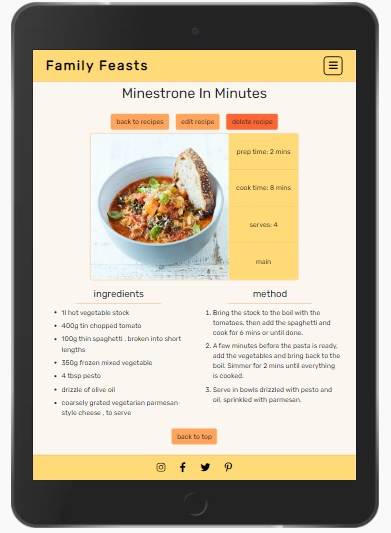

# Milestone Project Three - Testing

The live site can be viewed here - [Family Feasts](https://family-feasts.herokuapp.com/).

[Back to README file.](README.md)

## Testing
My code has been put through the following:
* W3C HTML validation. The W3C validator doesn't like the jinja templating language and raises a bad value error for every instance where its used. So to avoid this I put each HTML file through the validator as it appears in the view page source document (accessed by left clicking the page). Things that got highlighted were:
    * Duplicate ID's "staticBackdropLabel" in recipes.html caused by the code that generates the delete button and confirmation modal. As an ID needs to be unique I altered the names to include the relevant ID so that it's now unique in every instance where it gets generated. 
    * On the home page I got a warning of *"Consider using the h1 element as a top-level heading only."* As I'm using the h1's in question as headings for the about and why cook together sections I've chosen to ignore this.  
    * I changed the `<section>` tag to a `
` on the following documents because the `` on the base.html was already surrounded by a `<section>` tag:
        * login.html
        * register.html
        * add_recipe.html
        * edit_recipe.html
* CSS AutoPrefixer.
* W3C CSS validation - passed.
* JSHint JavaScript validation - no errors.
* PEP8 online check - boths files "all right".

## Functionality
### Manual Testing
These are the steps I went through testing my website and it's functionality.

**Navigation:**
1. Clicked on all the links in the navigation bar to ensure they do what they're supposed to do.
    * I did this whilst logged in and out, checking that the correct links appear each time.
2. Clicked the logo at various points to make sure that doing so takes me back to the home page.
3. Hovered over the links and buttons to make sure the hover classes are working.
4. Checked the navigation bar remains at the top of the page at all times and is never hidden by any other content.
5. Changed the window width to below 992px in order to check that the navigation bar content changes. A menu icon should be displayed to the right and all links should now display via a dropdown menu only.
    * The logo is always positioned top left.
6. Toggled the menu icon button on/off to check it displays and hides the dropdown menu accordingly.
    * All links are now shown in this dropdown menu.
    * Call-to-action buttons now appear as links.
7. Repeated step 1 but using the dropdown menu only.

**Footer:**
1. Checked the footer sticks to the bottom of every page and never hides any content.
2. Checked that the social links are always aligned centrally.
3. Clicked on all icons in the footer to check that they open and do so in a new tab.
4. Repeated step 1-2 but at different breakpoints. 

**Buttons:**
1. Hovered over all buttons to check they invert colour on hover.
2. Clicked on all buttons checking that they do what they should.
3. Checked when numerous buttons are used that they are responsive and will stack on top of each other. They should remain centrally aligned to their containers as they decrease in width.

**Page and section headings:**
1. Checked that page/section title's are always aligned centrally and positioned correctly.

**Home:**
1. Checked that the background image isn't pixelated and loads as intended.
2. Checked the text overlay box appears and that the relevant text and button are visible within it.
    * The box and its contents should always be justified and aligned centrally.
3. Checked the save, share and experiment sections are displayed as intended at varying breakpoints:
    * Across the entire page on widths above 992px.
    * In two separate rows between widths of 768px and 992px.
    * In three rows on widths below 768px.
    * The three sections always appear separate.
4. Checked the why cook together section displayed as intended at varying breakpoints:
    * Each section should appear across the page on widths above 992px and consist of an image next to a block of text.
        * Checked the pictures load, are positioned well and are of good quality.
        * Text within the text boxes is legible and the boxes adapt to a change of width.
    * Below 992px the images should get hidden with the text boxes stretching to fill the full width of the page and stack one on top of another.

**Recipes:**
1. Check that the page title changes to include the name of a category when a filter is applied e.g. breakfast recipes or dessert recipes when the relevant button is clicked.
2. Search bar is positioned between the title and the filter buttons and is displayed centrally at all breakpoints.
    * Checked it contains a placeholder of “search all recipes by name or ingredient”.
    * Checked that an orange submit button is built into the right hand side of the input field and loads showing an icon of a magnifying glass. Button has the same hover class as all other buttons.
3. Test search function:
    * Text input is required to search.
    * Searched for egg.
        * Title changed to “search results for egg”.
        * All recipe cards for the recipes that have egg in their titles or ingredients list are now shown below.
    * Searched for something that doesn’t exist – swede:
        * Title changed to “search results for swede”.
        * No cards appear. A message stating "no recipes containing ‘swede’" appears where the cards would otherwise.
4. Buttons used to filter recipes shown are dynamically generated using information from the categories section in the database. Checked that all categories in the database have a button.
    * Checked that if a category is added or removed from the database these buttons alter accordingly.
    * Checked that each button applies the intended filter and that the relevant recipe cards are displayed below.
5. Checked that if there are no recipes for that category then a message stating “no recipes for this category yet” appears where the cards would otherwise.
    * Checked that a call-to-action button appears underneath this message if the user is logged in to add a recipe.
6. Checked that the recipe cards are displayed as intended at varying breakpoints:
    * In four columns on screen widths above 1200px.
    * In three columns on screen widths between 992px and 1200px.
    * In two columns on screen widths between 768px and 992px.
    * In one column on screen widths below 768px.
7. Each card contains:
    * A picture of the recipe, which is positioned well and is of good quality.
    * The recipe title.
    * The "view recipe" button.
        * Other buttons will appear here also based on the user’s registration status.

**View recipe (individual recipe pages):**
1. Checked that the correct recipe title is displayed at the top of the page.
2. The appropriate buttons based on the user’s registration status appear in a row underneath the title.
    * "back to recipes" button appears for every user and returns the user to the recipes page.
    * Additional buttons: "delete recipe" and "edit recipe" should show here if the recipe was uploaded by the user currently logged in or if they have admin rights.
3. Checked that the correct information is pulled from the database and displayed as expected with the image, times, servings and category name displayed in a table while the ingredients and method are listed below side by side.
4. On screen widths of below 768px the table adapts to smaller screen sizes now displaying the times, servings and category name underneath the image. The lists are still below the table but now positioned one on top of another.
5. Checked that the "back to top" button has a matching hover class and scrolls the page back to the top on click.

**Register:**
1. Checked the number of input fields, 3 in total: username, password and confirm password. Each having a relevant label and input instructions where necessary. 
2. Tested the buttons and link:
    * Pressed "cancel", which takes me back to the home page.
    * Pressed "register" to try and send an empty form. Input required error message appears as it should.
    * Clicked the log in link, which took me to the login page.
3. Checked that if a username already exists or the passwords dont match that the relevant flash message appears.
4. Tested that the form validated the inputted data correctly when the criteria from step 3 is met. The form will then only send once the following conditions are met:
    * Username is entered and contains letters and numbers only. Usernames also need to be between 5 and 20 characters long. 
        * Checked error message appears under the input field if criteria isn't met.
    * Passwords should also be between 5 and 20 characters long and are also required.
        * Checked error message appears under the input field if criteria isn't met.
5. On successful completion of the form I'm directed to my newly created user profile page and a flash message displays “registration complete!”

**Log in:**
1. Checked the number of input fields, 2 in total: username and password. Each having a relevant label.
2. Tested the buttons and link:
    * Pressed "cancel", which takes me back to the home page.
    * Pressed "log in" to try and send an empty form. Input required error message appears as it should.
    * Clicked the register here link, which took me to the register page.
3. Tested that the form validated the inputted data correctly, the criteria is the same as that in the registration form. The form will only send if all the conditions are met.
    * Checked error message appears under the input field if criteria isn't met.
4. On successful completion of the form the data is cross-referenced against data in the database:
    * If neither field match anything in the database then a flash message stating "incorrect username or password entered" appears.
    * On successful completion of the form I'm directed to my existing user profile page.

**Log out:**
1. When logged in the logout button should be located at the top right of the screen in the navigation bar. On screen widths below 992px the button becomes a link, which is found in the dropdown menu.
2. When the button or link is clicked I'm logged out, I get redirected to the login page and a flash message appears reading “you’ve been logged out!”
3. My session cookie should have been removed so I should no longer have access to any unauthorized content:
    * Tried to access the add recipe page via the URL. I get redirected to the login page and the flash message reads “you need to be logged in to perform this task!”

**User profile:**
1. Checked that the user’s username is displayed at the top of the page.
2. Seen that the “view all recipes”, “add recipe” and “delete profile” buttons are located underneath the title.
    * Checked that when the user has admin rights the “delete profile” button becomes the “manage categories” button.
3. If the registered user has previously uploaded any recipes then:
    * Checked that recipe cards display recipes uploaded by that user only under the heading of "my recipes".
    * Check the cards all have the appropriate buttons to take any further action.
4. If no recipes have been created by the registered user then a message to say “you’ve not added any recipes yet!” appears. A call-to-action button also appears in order to add a recipe.

**Add recipe:**
1. Checked the number of input fields, 8 in total: recipe name, recipe image, category, servings, prep time, cook time, ingredients and method.
    * Each have a relevant label and input instructions where necessary.
2. Tested the buttons:
    * Pressed "cancel" - takes me to the recipes page.
    * Pressed "clear form" – reloads the page.
    * Pressed "add recipe" to try and send an empty form. Input required error message appears.
3. Tested that the form validated the inputted data correctly. The form will then only send if all fields are filled in and the following conditions are met:
    * Recipe name is no longer than 35 characters long. 
    * Recipe image is an active URL link.
    * Category name is selected from the dropdown menu.
    * Serving is an integer between 1 and 100.
    * Timings are an integer between 0 and 999.
    * Ingredients and method are required.
        * Error messages appear under the input fields if requirements aren't met.
4. On successful completion of the form I get redirected to the newly created recipe page, which will show the recipe I’ve just added.

**Edit recipe:**
1. Checked the form is the same as that found on the add recipe page and pre-populated with the data of the recipe I'm editing.
2. Tested the buttons:
    * Pressed "cancel" - takes me to the recipes page.
    * Pressed "update recipe" – the recipe page will load with a flash message of “your recipe has been updated!”
    * Pressed delete recipe – deletion modal pops up. 
3. Tested that the form validates the data inputted correctly, the criteria is the same as the add recipe form. All fields are required and the form will only send if all conditions are met.
4. On successful completion of the form I get redirected to the recipes page, which will show the updated recipe information and a flash message states that "recipe has been updated".

**Manage categories:**
1. Checked that there is only one input field; category name. It should have the relevant label and input instructions.
2. Tested the "add category" button:
    * Pressed button to try and send the form empty. Input required error message appears as should.
3. The form only sends if the category name is between 1 and 10 characters and can contain letters and numbers only.
    * Checked error message appears under the input field if criteria isn't met.
4. On successful completion of the form the page reloads and a flash message saying “the category has been added!” appears.
5. The newly created category now appears on a card in the manage categories section below.
6. As cards are dynamically generated using information from the categories section in the database I checked that all categories that exist have a card.
    * Checked each card has a delete button.
    * Checked that the new category appears on the recipes page (as a button) and in the dropdown menu on both the edit and add recipe forms.
7. Checked that the cards are displayed as intended at varying breakpoints:
    * In four columns on screen widths above 1200px.
    * In three columns on screen widths between 992px and 1200px.
    * In two columns on screen widths between 768px and 992px.
    * In one column on screen widths below 768px.

**Delete functions:**
1. Checked that all deletion buttons prompt the “are you sure...” modal to appear to proceed with the deletion.
    * The close button closes the modal with no action taken.
    * The delete button triggers the deletion process.
2. Deleting a recipe:
    * When a recipe is deleted I’m redirected back to my profile page.
    * A flash message reading “your recipe has been deleted!” appears.
    * Checked that the recipe can no longer be found on the site.
    * Checked that this process can only be completed by the user who’s profile it is or someone with admin rights.
3. Deleting a profile:
    * When a profile is deleted I’m redirected back to the registration page.
    * A flash message reading “profile deleted!” appears.
    * Checked that I can no longer log into the site using the deleted credentials.
    * Checked that this process can only be completed by the user whose profile it is.
4. Deleting a category:
    * On successful deletion the manage categories page reloads and a flash message saying “the category has been deleted!” appears.
    * Checked that the category no longer appears on the recipes page (as a button) or in the dropdown menu on either the edit/add recipe forms.
    * Checked that this action can only be done by someone with admin rights.

### Defensive design / "brute forcing"
I put measures in place in my app.py to stop instances of certain types of user being able to access certain features, run certain functions or access pages (sometimes known as brute forcing). Below shows a table illustrating the tests I did to check the accesses and restrictions I put in place work based on a user’s login/registration status or admin rights. The table indicates how the site responds in these instances.

## Responsiveness
Whilst building my site I have been checking my progress and testing any changes made using Chrome DevTools at different breakpoints. I try to push my work to GitHub as often as possible so I can physically see the live site on either my desktop or iPhone via Heroku. I do this at varying stages of the build and especially when new features get added, as I find physically seeing something more beneficial than a projection.

I have physically tested my site on my iPhone 6 using both Safari and Chrome. I have tested for responsiveness on other devices using DevTools along with the Responsive Design Mode on Firefox. Using these tools I have tested on numerous mobile devices such as the Moto G4, Galaxy X9 and the iPhone range as well as numerous tablet devices in both landscape and portrait views.

## Browser compatibility
I have physically tested my website by completing my manual testing plan on the following browsers and devices:
* Chrome (desktop and iPhone).
* Firefox (desktop).
* Microsoft Edge (desktop).
* Safari (iPhone).

I also tested compatibility at varying screen sizes to test the responsiveness on each Browser using Chrome DevTools along with the Responsive Design Mode on Firefox or the Inspect tool on Microsoft Edge.

